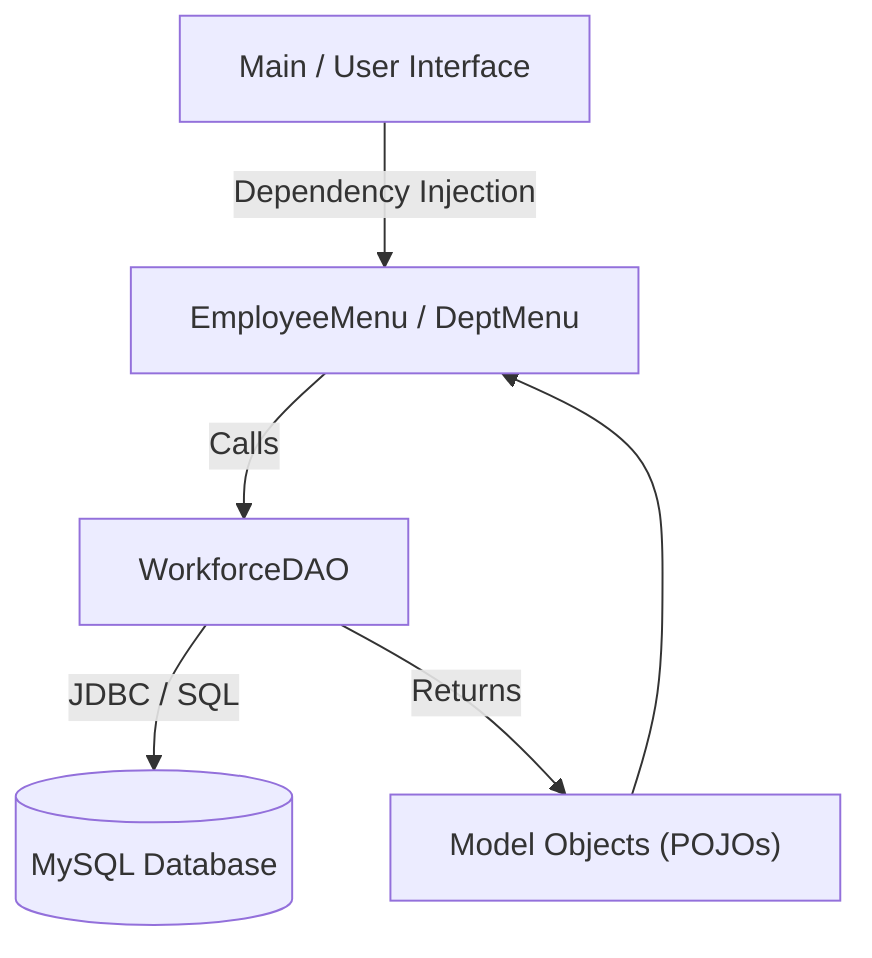

# 🏢 Workforce Allocation System

   

**A robust, Java-based console application (CLI) designed to manage corporate workforce resources, enforce departmental budgets, and maintain data integrity.**

## 📖 Project Overview

This application serves as a centralized **Command Line Interface** for HR and Department management. Unlike simple CRUD tools, this system implements **Business Logic Validation** at the application layer. It ensures that personnel decisions (hiring, transferring, salary adjustments) do not violate financial constraints or database integrity rules.

It demonstrates a "Backend-First" approach, prioritizing **data safety**, **ACID principles**, and **modular architecture** over web-based application.

## 🚀 Key Features

### 💰 Financial Integrity & Budget Logic
The system acts as a financial gatekeeper. It does not allow HR actions that would bankrupt a department.
* **Pre-Hire Validation:** Automatically calculates the annualized impact of a new hire against the department's remaining budget.
* **Transfer Analysis:** Before moving an employee, the system checks if the *target* department can afford the incoming salary.
* **Salary Adjustment Logic:** Validates raises against the departmental cap before committing to the database.

### 🛡️ Robust Architecture & Security
* **DAO Pattern (Data Access Object):** Strict separation between Business Logic (`ui` package), Data Models (`model` package), and Database Access (`dao` package).
* **SQL Injection Prevention:** Utilizes `PreparedStatement` for 100% of database queries to ensure security against malicious input.
* **Safe Deletion:** Handles Foreign Key constraints gracefully (e.g., preventing the deletion of a Department that still contains active Employees).

### ⚙️ Advanced CRUD Operations
* **Atomic Updates:** Granular control over "Promotions" (Role change) vs "Merit Increases" (Salary change).
* **Search & Filtering:** Dynamic SQL pattern matching (`LIKE`) to find employees by partial name or job title.
* **Interactive Console UI:** A robust, crash-proof CLI with input sanitization and clear user feedback.

---

## 🏗️ Technical Architecture

The project follows a modular 3-layer architecture:



## 💻 Usage Demo

**Scenario:** Attempting to hire an expensive engineer into a department with low budget.

```text
--- ➕ HIRE NEW EMPLOYEE ---
Enter First Name: Ivan
Enter Last Name: Petrov
Enter Job Title: Senior Java Dev
Enter Monthly Salary (EUR): 15000
Enter Department ID: 2

--- 📊 BUDGET ANALYSIS REPORT ---
Department Budget:    1,000,000.00 EUR
Current Allocation:     920,000.00 EUR
New Hire Impact:       +180,000.00 EUR/year
----------------------------------------
Projected Total:      1,100,000.00 EUR

❌ FAILURE: Hiring Request Denied.
Reason: Exceeds budget limit by 100,000.00 EUR
```

## 🛠️ Setup & Installation

### Prerequisites
* Java Development Kit (JDK) 17 or higher
* MySQL Server 8.0+
* Maven

### Step 1: Database Configuration
1.  Ensure your MySQL server is running on port `3306`.
2.  Import the database schema provided in `sql/schema.sql` (or create a database named `employee_allocation`).
3.  Update the credentials in `WorkforceDAO.java` (Constructor) to match your local environment.

### Step 2: Build and Run
Clone the repository and run via IntelliJ or Terminal:

```bash
git clone [https://github.com/dikiroff/employee-allocation-system.git](https://github.com/dikiroff/employee-allocation-system.git)
cd employee-allocation-system
mvn clean install
mvn exec:java -Dexec.mainClass="io.github.dikiroff.Main"
```


## 📂 Project Structure

```text
src/main/java/io/github/dikiroff
├── dao
│   └── WorkforceDAO.java    // The Database Engine (JDBC Logic)
├── model
│   ├── Department.java      // POJO for Departments
│   └── Employee.java        // POJO for Employees
├── ui
│   ├── EmployeeMenu.java    // Handling Employee interactions
│   ├── DepartmentMenu.java  // Handling Department interactions
│   └── InputHelper.java     // Static utility for crash-proof input
└── Main.java                // Entry point 
```


## 👨‍💻 Author

**Dimitar Kirov**
* Aspiring Backend Software Engineer
* https://github.com/Dkiroff